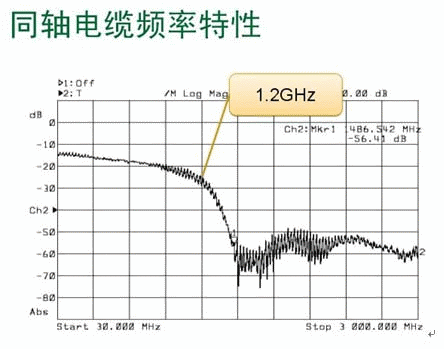
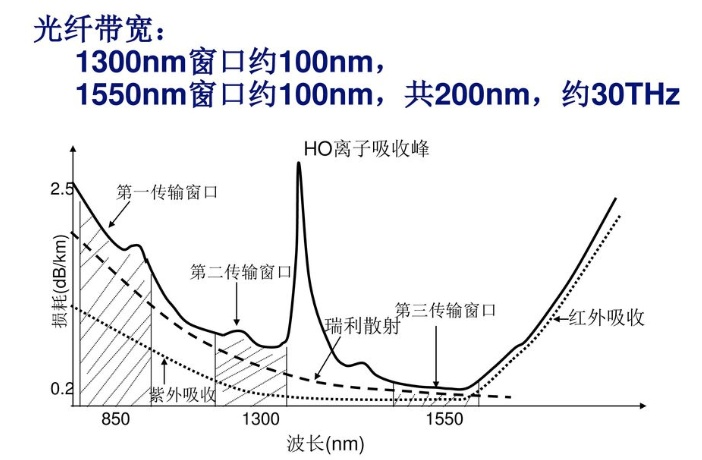

#通信基本问题

通信最基本问题是：在保证信息准确的情况下，尽可能的提高传输速率

## 从“电报”说起

拿一根铜线，一个开关，一个示波器，一块电池，连成一个回路。

开关开，示波器是一个高电平，记为’1‘

开关闭，示波器是一个低电平，记为‘0’

反复操作开关便可以传递信息

如果我每秒操作一次开关，传输的信息速率是1b/s

如果假设我可以无限制的加快操作速度，是不是传输的信息速率也会无限大？

显然不是

高速操作开关时，在铜线中所传递的电压信号的频谱中的高频成分的功率很高

即将信号看作是不同频率电磁波的加和，其高频电磁波的功率很高

而铜线是一个典型的低通系统，即对高频信号的阻抗很大

所以高速信号在铜线中会发生比较大的衰减，接收端会无法分辨是‘0’还是‘1’

低通特性是早期传统电传输线的一个共性

包括：同轴电缆（AV线） 架空明线（老式电话线）双绞线（网线）等

传输线理论这门课程从电路的角度，详细研究了这些电传输线的性质

但是近年，现在很多学校都不开设这门课了

原因之一是电传输线已基本被光纤所取代，用电路理论来分析信道显得有些过时了

有线通信早已进入光纤的时代

## 光纤为什么速度快？

光纤的最大优势就在于传输速度快

这里需要澄清的是，光纤的传输速度快和光速是没有关系的

光在光纤中的传播速度和电在铜线中的电子传导速率相仿，都接近光速

实际因为光在光纤中是全反射，走的路径长，还比铜线的传导速率慢一些

光纤的速度快，更准确来说是带宽大

那带宽是什么？

上节说铜线是一个低通系统，只允许低频信号通过

称铜线能够允许通过（衰减不超过2db）的信号频率范围为铜线的带宽（通频带）

铜线的带宽越高，显然我可以操作的开关频率便越高，传输速率也就越高。

**信道的带宽，决定了信号传输速率的上限**

而光纤的频率特性大概是这样:

可以看到光纤的带宽在消除水锋之后有100T，一个工作窗口就有30T

同轴电缆则只有1.2G

所以光纤的传输速率上限比同轴电缆高很多，比铜线高更多（简单铜线的传输特性更差）

这也就是为什么光纤速度快

目前在实验室中，只一根光纤就已可以达到100tb/s以上的速率

实际在谈衰减的时候，距离是个非常重要的指标，以上讨论为了简便都忽略了

在短距离情况下，普通电传输线的带宽也能满足目前的需求

所以现在家里还用网线（双绞线）接光猫

##  为什么需要调制？

信息传输速率 = 带宽 * 频谱利用率  

带宽大是一回事，怎么利用带宽是另外一回事

调制的目的，简单来说，就是利用带宽，提高频谱的利用率

### 低通信号

对于开头铜线通信的那个例子

开闭开关就是一种调制，有就是‘1’，没有就是‘0’

可以换一种调制方式：以电压的大小来携带信息

比如电压在0-1v时为‘00’，在1-2v时，为‘01’，在2-3v时，为‘10’，在4v以上，为‘11’

这样我可以在不改变信号频率的情况下，将信息传输速率提高一倍

这就是通过调制来提高频率利用率的一个例子

但是如果我将电压的范围无限细分，是不是传输速率也可以无限提高呢？

显然不是

这是因为接收信号总是存在一定的噪声

比如接收机的热噪声

由于噪声的存在，无法将电压的幅度分的过细，否则将难以分辨

所以在通信中，信噪比是一个非常关键的存在

如果信噪比足够大，信号功率足够强，往往意味着更高的速率

### 带通信号

对于光纤和无线通信来说

信道的通频带都是”带通“的，只能传输带通信号

带通信号的一般形式如下：
$$
\begin{split}
& A\cos(2\pi t+\phi) \\
& = Re\{(a+bi)e^{j2\pi t}\}\\
& = a\cos(wt)-b\sin(wt)
\end{split}
$$
f是带通信号的中心频率

A和$$\phi$$代表了带通信号的幅度和相位（都是关于时间的函数，公式中为了简便没有体现出来）

可以看到，这个带通信号也可以表示为$$Re\{(a+bi)e^{j2\pi t}\}$$

其含义为，任何带通信号可以表示为一个复信号搬移到特定的频率f附近

复信号是实际不存在的，可以理解为分析信号的工具

如果简单的将实信号搬移到中心频率，会造成巨大的频谱浪费

带通信号的另一个等价形式是$$a\cos(wt)-b\sin(wt)$$

这个形式显示了怎么物理实现复信号的搬移，即IQ调制

它也显示了，一个带通信号其实是由两个正交信号所张成的

所以可以把带通信号想象成一个二维平面

a和b就是x值和y值，相位$$\phi$$和幅度A都可以用a和b表示

各种相位调制，强度调制，QAM调制，本质上都是这个式子

上面提到了信号正交的概念，

余弦信号，正弦信号，以及它们的倍频信号都是正交的

（所谓正交，是指互相关函数恒为零，即相乘再积分为零）

只要信号是正交的，就可以通过简单的相关运算进行解调，对于接收十分有利

从这个角度考虑，为了进一步提高频谱利用率，信号可以表示为任意正交信号的加和
$$
\sum_i a_i\cos i w_0t + b_i \sin i w_0t
$$
这便是OFDM 正交频分复用的基本思想

## 香农公式

从上面的讨论可以看出，影响通信速率的两个基本因素：噪声和衰减

其中衰减体现在信道的带宽上，噪声体现在信噪比上

那么在特定的带宽以及信噪比下，通信的速率最高可以达到的多少呢？

这个问题由香农公式来回答：
$$
C = W\log{(1+S/N)}
$$
其中C是信道容量，W是带宽，S/N是信噪比

香农公式理论上升华了通信的基本问题，指出了在特定信道条件下，信息传输速率的极限

为通信技术的优化提供了明确的方向

